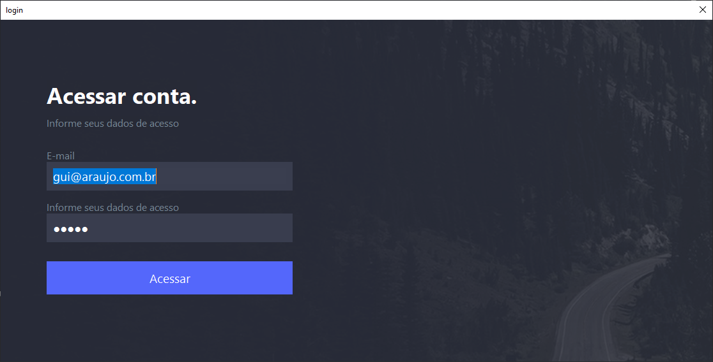
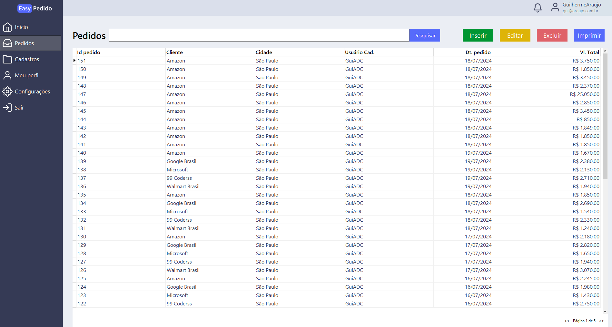
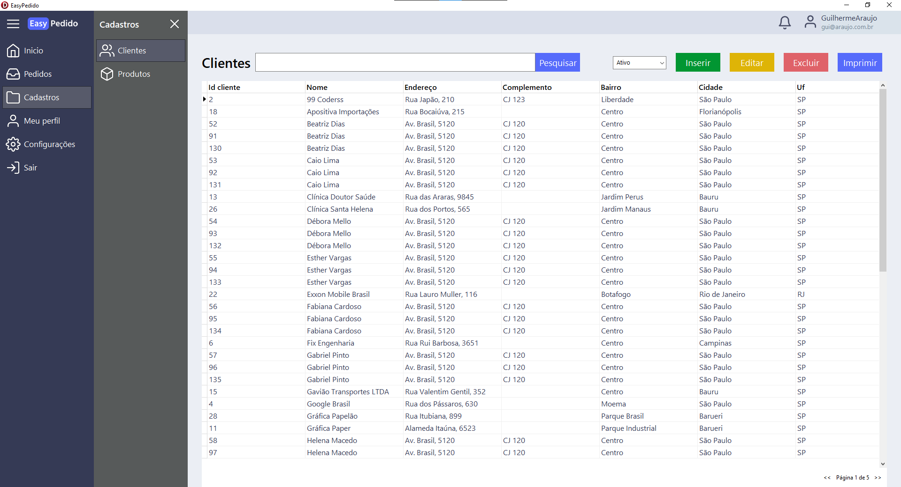
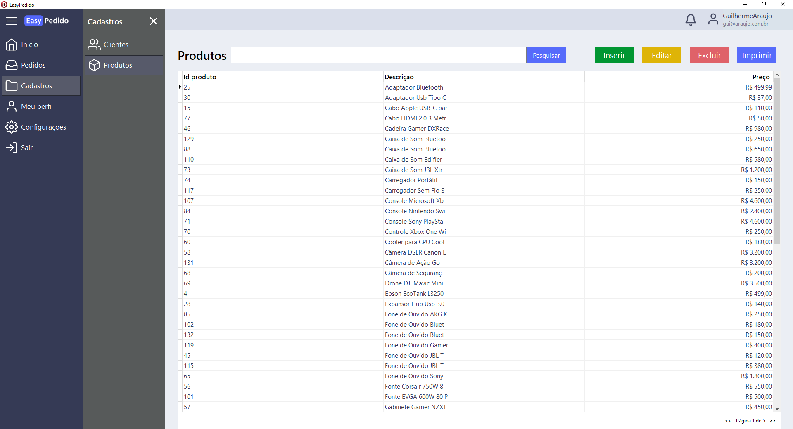
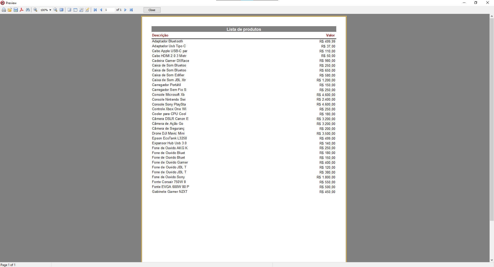

# Mini-ERP de gestão de vendas

## Descrição do Projeto

<p align="center"></p>
<h1 align="center">
    <a> Horse |</a> 
    <a> Delphi VCL |</a>
    <a> Fast reports |</a>    
</h1>
<p align="center">🚀 Projeto criado com o intuito de auxiliar e gerenciar as vendas da sua empresa.</p>
<br>
<h1 align="center">

  <p>Login</p>
      
  
  <p>Pedidos</p>
  
  
  <p>Clientes</p>  
  
  
  <p>Produtos</p>  
  
  
  <p>Impressão</p>
  
</h1>

### Pré-requisitos

Antes de começar, você vai precisar ter instalado em sua máquina as seguintes ferramentas:
[Git](https://git-scm.com), [Delphi](https://www.embarcadero.com/br/products/delphi/starter), [Boss](https://github.com/HashLoad/boss), [FastReport](https://www.fast-report.com/downloads/fast-report-vcl).

### 🎲 Rodando nossa aplicação

```bash
# Clone este repositório
$ git clone https://github.com/GuiADC/sistema-de-vendas-delphi.git

# Acesse a pasta do projeto no terminal/cmd
$ cd sistema-de-vendas-delphi

# Instale as dependências
$ boss install

### Autor

---

<a href="https://juniorwmr.github.io/">
 
 <br />

Done with ❤️ by Washington Muniz 👋🏽 !

[](https://twitter.com/juniorwmr) [](https://www.linkedin.com/in/juniorwmr/)
[](mailto:juniorripardo@gmail.com)
